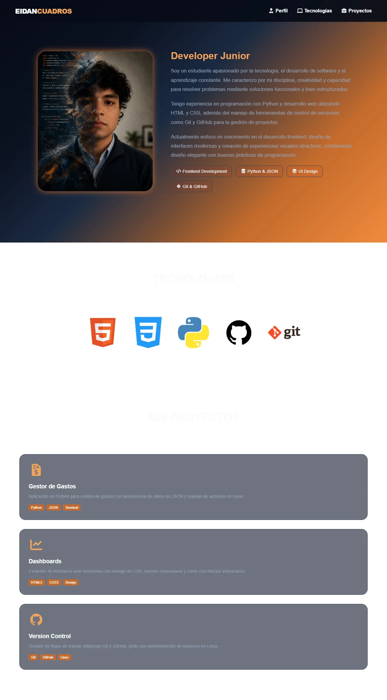
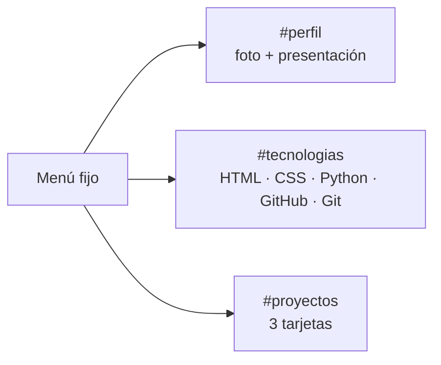

# Portafolio personal v1 — HTML y CSS

Mi primer portafolio web, hecho solo con **HTML5** y **CSS3**: perfil con foto y presentación, tecnologías que manejo y una selección de proyectos, sobre un diseño oscuro con degradado azul y naranja. Lo construí en mayo de 2026, al empezar mi formación.

Esta es la **versión base**, con las imágenes en la raíz del repositorio. La copia publicada en GitHub Pages está en [`SitioWebprueba`](https://github.com/Eidan210/SitioWebprueba).




## El problema

Para buscar mis primeras oportunidades necesitaba una página que me presentara: quién soy, qué tecnologías uso y qué he construido. El reto era hacerla atractiva solo con HTML y CSS, sin JavaScript.

## Tecnologías

| Tecnología | Para qué se usa |
| :--- | :--- |
| **HTML5** | Estructura semántica: `header`, `nav`, `main`, `section` y `article`, con anclas a cada sección. |
| **CSS3** | Variables (`:root`), degradados, `backdrop-filter`, transiciones, efectos `:hover`, Flexbox y Grid, y un `@media` para pantallas pequeñas. |
| **Font Awesome** | Iconos del menú, las etiquetas y las tarjetas de proyecto. |

## Funciones clave

- **Menú fijo** con anclas a *Perfil*, *Tecnologías* y *Proyectos*, y subrayado animado al pasar el cursor.
- **Tarjeta de perfil:** foto y presentación que se despliega con una transición, más etiquetas de especialidad (Frontend, Python y JSON, UI, Git y GitHub).
- **Tecnologías:** logos de HTML, CSS, Python, GitHub y Git con efectos al pasar el cursor.
- **Proyectos:** tarjetas con icono, descripción y etiquetas (gestor de gastos en Python, dashboards en HTML y CSS, control de versiones con Git).
- **Revelado con CSS puro:** las secciones aparecen con una transición en cuanto el cursor entra en la página (`body:hover`), sin JavaScript.

## Evidencias

La captura de arriba es la página completa con el contenido ya revelado (cursor sobre la página).



## Instalación y uso

Sin dependencias:

```bash
git clone https://github.com/Eidan210/Sitioweb.git
cd Sitioweb
```

Abre `index.html` en el navegador y mueve el cursor sobre la página para revelar las secciones. Los iconos de Font Awesome se cargan desde internet.

```text
Sitioweb/
├── index.html    # Estructura del sitio
├── styles.css    # Estilos, variables y transiciones
├── *.png         # Foto de perfil
└── *.ico         # Logos de tecnologías
```

## Aprendizajes

- **Estructurar una página** con etiquetas semánticas y navegación por anclas.
- **Diseñar con variables CSS:** una paleta definida una vez en `:root` y reutilizada en todo el sitio.
- **Dar vida a una interfaz sin JavaScript** con transiciones, `:hover` y `backdrop-filter`.
- **Lección para la siguiente versión:** revelar el contenido con `body:hover` deja las secciones ocultas en móviles, donde no hay cursor. Mi portafolio actual ([portafolio-junior](https://github.com/Eidan210/portafolio-junior)) muestra el contenido por defecto y anima solo como mejora.

---

Desarrollado por **Eidan Alexander Carreño** ([@Eidan210](https://github.com/Eidan210)).
